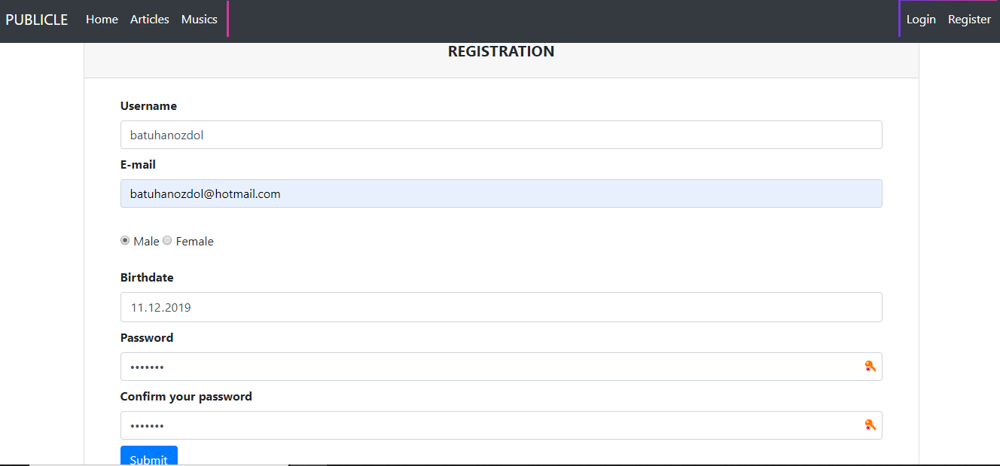
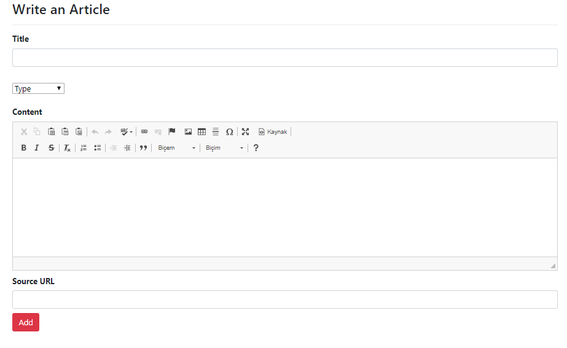
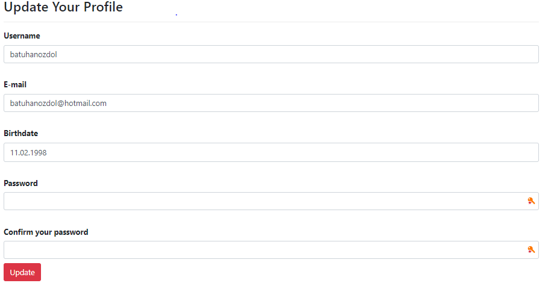
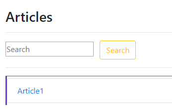
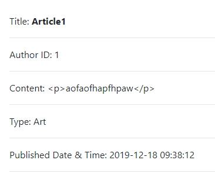
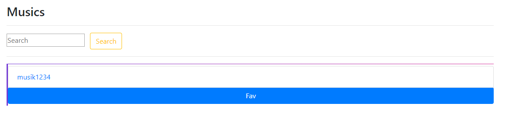
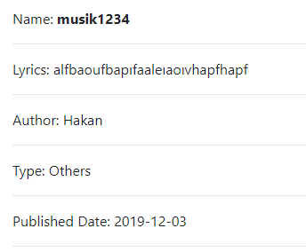

User Guide
==========

**explain how your application works from the user perspective, use
screenshots whereever appropriate**

**to add a picture, use the following example**::

      Users must register to system before log-in if they have no account. User must enter their username, email and password; other parts are optional. Passwords will be hashed for storing in tables.
	  
.. figure:: login.PNG
      :scale: 50 %
      :alt: Login

      User and admin will login to system by entering their username and password. 

.. figure:: index.PNG
      :scale: 50 %
      :alt: Homepage

      I created a logo and use it on my homepage. Success flash message will shown if user logged in to system.
	  
.. figure:: userdashboard.PNG
      :scale: 50 %
      :alt: User Dashboard
	  
      User can see their articles and favourite musics. They can add articles.
	 

      User must enter article title, type and content to add article. Source URL is an optional part. Ckeditor is used in content section to make a well-formed view.

	  
      Users can update their information with Update Profile button. Validation and error handling are applied. Users can also delete their account by clicking delete profile button.
	  
.. figure:: admindashboard.PNG
      :scale: 50 %
      :alt: Admin Board
	  
      All articles and musics are listed on admin dashboard. Admin cannot update its profile and delete it. Admin can add music.
	  .. figure:: addmusic.PNG
      :scale: 50 %
      :alt: Add Music
	  
      Musics are added by entering its song name, type, lyrics, song author and published date. Only admin can add musics.
	  

      Articles are listed by clicking Articles section on navbar. User can see all articles and making a search which articles they want to read.
	 

	 
      By clicking article name on table in articles section or on dashboard. Article's information will be seen.
	  

	
      Musics are only added by admin. In musics section on navbar. Every user can see listed musics and if they like them, they can add their favourite list by clicking fav button. Users can see their favourite music list by looking at their dashboard. They can also unfav selected musics.
	  

	  
      By clicking music name on table in musics section or on dashboard they favved. Music's information will be seen.
 

.. toctree::

   member1
